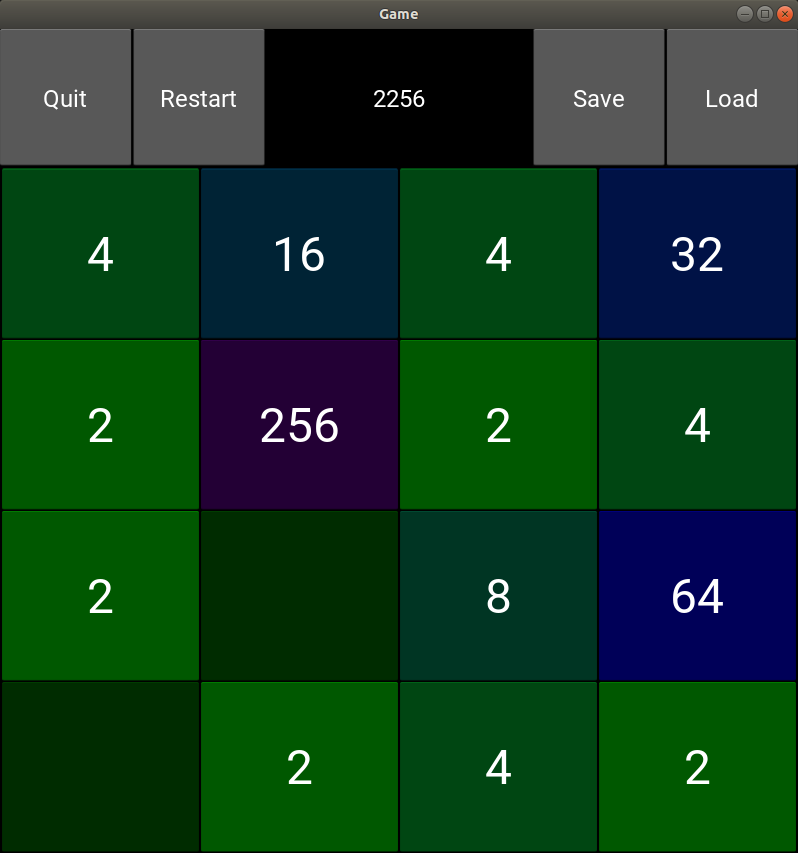

# Kivy-2048
A 2048 game using Python and Kivy. As the final project of the course 10.009-The Digital World

Author: Kevin Ma Yuchen

## Introduction
This is a classical 2048 game written in Python using Kivy for the GUI! Don't know what 2048 is? Well... it's an easy game in which you slide numbered tiles. If the tiles with the same number collides - they will merge into a tile with doubled number! And your goal is to make the tile 2048, or even as big as you can do with the 4x4 grid! (theoretically it's 2^17 = 131072 FYI)

### Dependencies
- Kivy
- numpy

## How to run?
- install the libraries in `reqirements.txt` with command `pip3 install -r requirements.txt`
    - Do it in a virtual environment if you prefer. Check [this](https://github.com/Kevinskwk/Misc/blob/master/Python/Packages_and_Environments.md) for python virtual environment setup guidance.

- navigate to the directory `Kivy-2048/`
- run 2048.py with command `python3 2048.py`

## How to play?
- Press the Start button to start a new game.

### Operations:
- With mouse: press and **drag** up/down/left/right
- With keyboard: use up/down/left/right keys

### Options
- Use the "Save" button to save the current game, the saved game will be stored in a file call save.p
    - **DO NOT** change the file name or move the file if you don't want to lose your saved game.
- Use the "Load" button to load previously saved game.

## About the code
The code has a typical Kivy App structure. There is a *GameApp* class inherited from *App* that consists of two custom *Screen*'s. The *Menu* screen acts as a cover page and show the title and basic options of start and exit. The *Game* class is the main class. All of the game implementations are in this class.

## Documentation
### *class* Tile(*value: int*)
> A tile object inherited from *Button* class of Kivy. With number and background colour.

#### Properties
- **value** - the value of this tile (2, 4, 8, 16...)

#### Methods
**set_value(*value:int*)**
> Setter function for the *value* property, changes the tile text and background colour at the same time as setting the value.
- **parameters:**
    - **value** - the value to set
- **Returns:** None

**get_value()**
> Getter function for the *value* property, returns the value of the tile.
- **parameters:** None
- **returns:** the value of the tile

-----

### *class* Menu()
> The menu screen class. Inherited from the Kivy *Screen* class. Includes tile, start button, and exit button.

#### Widgets
- **title** - Label widget displaying the title
- **startButton** - Button widget to shift to the Game screen
- **exitButton** - Button widget to exit the game

#### Methods
**start_game()**
> callback function for *startButton*, changes the current screen to the game screen

### *class* Game()
> The main game screen class. Inherited from the Kivy *Screen* class. Includes the tile grid (the main game area), score display, and save, load, restart, quit buttons

#### Widgets

- **top_bar** - BoxLayout including score display and buttons
    - **scoreLabel** - Label widget displaying current score
    - **quitButton** - Button widget to move back to menu screen
    - **restartButton** - Button widget to restart the game
    - **saveButton** - Button widget to serialize the game and save into a local file
    - **loadButton** - Button widget to load previously saved game
- **grid** - GridLayout including 4*4 Tile widgets
    - **tile** - Custom Tile widget

#### Properties

- **score** - int, the score of the current game
- **over** - bool, indicates whether current game is over
- **win** - bool, indicates whether current player has won (make number 2048)
- **touch_initial** - tuple of int, the initial position of the mouse when pressed, used for sliding detection
- **matrix** - numpy.ndarray, the matrix containing values of each tile. Main game implementation is based on this

#### Methods

##### Controlling
**_touch_down()**
> change *self.touch_initial* to the mouse position where mouse button is pressed down

**_touch_up()**
> get the position where the mouse button is released and detect the sliding. Call *move()* method accordingly to control the game

**_keyboard_closed()**
> function to close keyboard

**_on_keyboard_down()**
> callback function to get keyboard input. Call *move()* method accordingly to control the game

##### Game Implementation
**add_tile()**
> randomly add one tile with number 2 or 4.

**get_empty()**
> return a 2d numpy array with locations of empty entries

**move(*direction:int, trial=False*)**
> perform one move of the game, calls *shift* for all columns or rows
- **parameters:**
    - **direction** - int, values 0, 1, 2, 3 represent down, up, right, left, respectively
    - **trial** - bool, when True: trial mode, won't changed the matrix, used to detect whether the game is over
- **returns:** tuple (changed, score)
    - **changed** - bool, indicates whether this move has changed the matrix, used to check whether the game is over
    - **score** - int, the score gain in this move

**shift(*row:1d numpy array, direction:int*)**
> shift the numbers and combine colliding numbers in one row
- **parameters:**
    - **row** - 1d numpy array, the row to perform shift on
    - **direction** - int, shift to left if 0, shift to right if 1
- **returns:** tuple (output, score)
    - **output** - 1d numpy array, the output row
    - **score** - int, score gained in this shift

**is_over()**
> check if the game is over by trying all possible movements (call *move()* in all four directions)

**is_win()**
> check if the player has reached 2048

**update()**
> update the values in the matrix to the tiles; call *is_win()* and popup notification if win; call *is_over()* and popup notification if over; update *self.win*, *self.over*, *self.scoreLabel.text*

##### Button Functions
**restart()**
> callback function for *restartButton*, reset the whole game

**save()**
> callback function for *saveButton*, serializes the current score and matrix, and dump into a local file using pickle

**load()**
> callback function for *loadButton*, reads from previously saved file and resume the saved game using pickle

**quit()**
> callback function for *quitButton*, changes the current screen to menu screen. **It won't reset the game.**

### *class* GameApp()
> main app class inherited from Kivy *App* class. Includes *Menu* screen and *Game* screen

## Known issues
- If you move too fast (before the animation finishes), the colour update will fail for this move and don't match the numbers. (So do it slowly and think twice!)